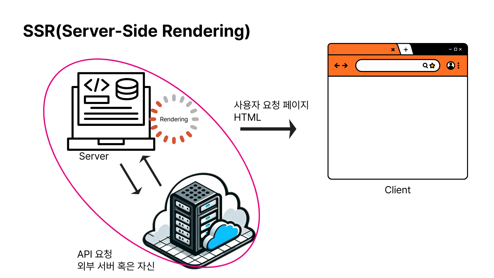
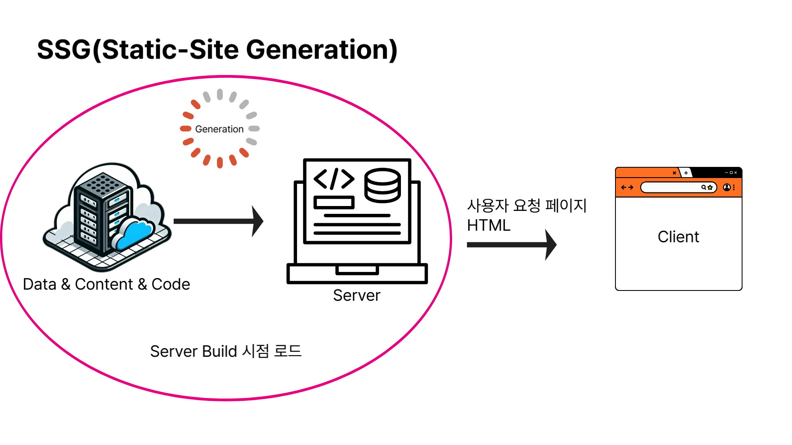
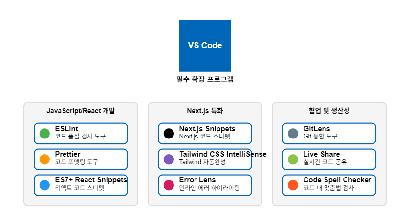

# Next.js와 프론트엔드 프레임워크 이해하기

<div align="center">
  
  <p><em>모던 웹 개발을 위한 완벽한 React 프레임워크</em></p>
</div>

---

## 📚 목차

- [프론트엔드 프레임워크 개요](#프론트엔드-프레임워크-개요)
- [웹 렌더링 아키텍처](#웹-렌더링-아키텍처)
  - [CSR (Client-Side Rendering)](#1-csr-client-side-rendering)
  - [SSR (Server-Side Rendering)](#2-ssr-server-side-rendering)
  - [SSG (Static Site Generation)](#3-ssg-static-site-generation)
  - [ISR (Incremental Static Regeneration)](#4-isr-incremental-static-regeneration)
- [Next.js 소개](#nextjs-소개)
- [Next.js의 핵심 기능](#nextjs의-핵심-기능)
- [React와 Next.js의 관계](#react와-nextjs의-관계)
- [개발 환경 구축하기](#개발-환경-구축하기)
  - [Node.js, npm 설치 및 확인](#nodejs-npm-설치-및-확인)
  - [VS Code 및 필수 확장 도구 세팅](#vs-code-및-필수-확장-도구-세팅)
- [Next.js 프로젝트 초기화](#nextjs-프로젝트-초기화)
  - [프로젝트 생성 및 설정](#프로젝트-생성-및-설정)
  - [프로젝트 구조 설명 및 실행](#프로젝트-구조-설명-및-실행)

---

## 프론트엔드 프레임워크 개요

프론트엔드 프레임워크는 웹 애플리케이션의 사용자 인터페이스를 구축하기 위한 도구와 구조를 제공하는 소프트웨어 프레임워크다. 개발자가 효율적이고 확장 가능한 방식으로 웹 애플리케이션을 개발할 수 있도록 돕는다.

### 프론트엔드 프레임워크의 필요성

| 이점                 | 설명                                   |
| -------------------- | -------------------------------------- |
| **코드 재사용성**    | 공통 기능을 추상화하여 반복 작업 감소  |
| **개발 시간 단축**   | 미리 구축된 구성 요소와 구조 활용      |
| **일관된 코드 구조** | 유지보수성 향상 및 협업 용이           |
| **성능 최적화**      | 프레임워크가 제공하는 최적화 기법 활용 |

---

## 웹 렌더링 아키텍처

웹 애플리케이션은 다양한 방식으로 렌더링될 수 있으며, 각 방식은 고유한 장단점을 가진다.

### 1. CSR (Client-Side Rendering)

<div align="center">
  
  <p><em>클라이언트 측에서 JavaScript로 페이지를 렌더링하는 방식</em></p>
</div>

#### 작동 방식

- 브라우저가 서버에서 최소한의 HTML 파일과 JavaScript 번들을 다운로드
- JavaScript가 실행되어 필요한 데이터를 API로부터 가져옴
- 동적으로 DOM을 조작하여 컨텐츠를 생성하고 표시

#### 장점과 단점

✅ **장점**

- 페이지 전환이 빠르고 매끄러움
- 서버 부하가 상대적으로 적음
- 풍부한 인터랙티브 경험 제공 가능
- API 중심 개발에 적합

❌ **단점**

- 초기 로딩 시간이 길어질 수 있음
- SEO(검색 엔진 최적화)에 불리함
- JavaScript가 비활성화된 환경에서 작동하지 않음

> **대표적인 사례**: React, Vue, Angular 기반 애플리케이션

---

### 2. SSR (Server-Side Rendering)

<div align="center">
  
  <p><em>서버에서 완성된 HTML을 생성하여 클라이언트에 전송하는 방식</em></p>
</div>

#### 작동 방식

- 사용자 요청마다 서버에서 페이지에 필요한 데이터를 가져옴
- 서버가 데이터와 함께 완전한 HTML을 생성
- 생성된 HTML을 클라이언트에 전송, 이후 JavaScript가 로드되어 페이지를 인터랙티브하게 만듦

#### 장점과 단점

✅ **장점**

- 초기 페이지 로드가 빠름
- SEO에 유리함 (검색 엔진이 완전한 HTML을 크롤링)
- 첫 의미 있는 페인트(FMP) 시간이 빠름
- 모든 디바이스/브라우저에서 기본적인 콘텐츠 접근 가능

❌ **단점**

- 서버 부하가 증가할 수 있음
- 페이지 요청마다 서버 작업 필요
- 클라이언트와 서버 간 왕복 지연 시간 발생

> **대표적인 사례**: Next.js, Nuxt.js, 서버 기반 PHP/Ruby 등

---

### 3. SSG (Static Site Generation)

<div align="center">
  
  <p><em>빌드 시점에 모든 페이지를 정적 HTML로 미리 생성하는 방식</em></p>
</div>

#### 작동 방식

- 빌드 시점에 필요한 모든 데이터를 가져옴
- 각 경로에 대한 HTML 파일을 미리 생성
- 생성된 정적 파일을 CDN에 배포하여 빠르게 제공

#### 장점과 단점

✅ **장점**

- 매우 빠른 페이지 로드 시간 (사전 렌더링된 HTML 제공)
- 보안 강화 (서버 측 로직 노출 감소)
- 호스팅 비용 절감 (정적 파일 서빙)
- 확장성 및 안정성 우수

❌ **단점**

- 동적 콘텐츠 처리 제한적
- 빌드 시간이 길어질 수 있음
- 자주 변경되는 콘텐츠에 적합하지 않음

> **대표적인 사례**: Gatsby, Next.js(정적 생성 모드), Jekyll

---

### 4. ISR (Incremental Static Regeneration)

<div align="center">
  
  <p><em>정적 생성과 동적 업데이트의 장점을 결합한 하이브리드 방식</em></p>
</div>

#### 작동 방식

- 빌드 시점에 일부 페이지를 미리 생성
- 설정된 시간 간격으로 백그라운드에서 페이지 재생성
- 재생성 전까지는 캐시된 버전 제공

#### 장점과 단점

✅ **장점**

- SSG의 성능 이점 유지
- 데이터 업데이트 반영 가능
- 전체 사이트 재빌드 불필요

❌ **단점**

- 구현 복잡성 증가
- 일부 프레임워크에서만 지원
- 즉각적인 콘텐츠 업데이트가 필요한 경우 적합하지 않음

> **대표적인 사례**: Next.js의 ISR 기능

---

### 렌더링 방식 비교표

<div align="center">

| 렌더링 방식 | 페이지 생성 시점 | SEO 효과 | 서버 부하 |   데이터 갱신    |          적합한 사용 사례           |
| :---------: | :--------------: | :------: | :-------: | :--------------: | :---------------------------------: |
|   **CSR**   |    클라이언트    |  낮음¹   |   낮음    |      실시간      |       대시보드, 관리자 페이지       |
|   **SSR**   |   요청 시 서버   |   높음   |   높음    |      실시간      |        사용자별 맞춤 콘텐츠         |
|   **SSG**   |    빌드 타임     |   높음   | 매우 낮음 |   재빌드 필요    |     블로그, 문서, 마케팅 페이지     |
|   **ISR**   | 빌드+주기적 갱신 |   높음   |   중간    | 주기적/요청 기반 | 자주 변하지 않는 데이터 기반 페이지 |

</div>

¹ _모던 SPA 프레임워크는 다양한 SEO 최적화 기술을 제공한다._

---

## Next.js 소개

<div align="center">
  
  <p><em>파일 시스템 기반의 직관적인 라우팅</em></p>
</div>

Next.js는 React 기반 프레임워크로, 웹 애플리케이션 개발에서 마주치는 다양한 문제를 해결하기 위해 Vercel에서 개발했다. "제로 설정" 철학을 바탕으로 복잡한 환경 구성 없이 최적화된 앱을 구축할 수 있도록 지원한다.

### React의 한계와 Next.js의 해결책

| React의 한계       | Next.js의 해결책                    |
| ------------------ | ----------------------------------- |
| **SEO 문제**       | 서버 사이드 렌더링과 정적 생성 지원 |
| **초기 로딩 성능** | 자동 코드 분할 및 최적화            |
| **라우팅 설정**    | 파일 기반 라우팅 시스템 제공        |
| **개발 환경 구성** | 통합된 빌드 도구와 설정             |

---

## Next.js의 핵심 기능

### 1. 다양한 렌더링 전략 통합

Next.js는 한 애플리케이션 내에서 여러 렌더링 방식을 혼합하여 사용할 수 있다.

<div class="code-container">
<div class="code-block">
<h4>SSR (Server-Side Rendering)</h4>

```javascript
// pages/ssr-example.js
export async function getServerSideProps(context) {
  const res = await fetch("https://api.example.com/data");
  const data = await res.json();

  return {
    props: { data },
  };
}

export default function Page({ data }) {
  return <div>{data.title}</div>;
}
```

</div>

<div class="code-block">
<h4>SSG (Static Site Generation)</h4>

```javascript
// pages/ssg-example.js
export async function getStaticProps() {
  const res = await fetch("https://api.example.com/static-data");
  const data = await res.json();

  return {
    props: { data },
    revalidate: 60, // ISR: 60초마다 재생성
  };
}

export default function Page({ data }) {
  return <div>{data.title}</div>;
}
```

</div>

<div class="code-block">
<h4>CSR (Client-Side Rendering)</h4>

```javascript
"use Client";
// pages/csr-example.js
import { useState, useEffect } from "react";

export default function Page() {
  const [data, setData] = useState(null);

  useEffect(() => {
    async function fetchData() {
      const res = await fetch("/api/data");
      const newData = await res.json();
      setData(newData);
    }

    fetchData();
  }, []);

  if (!data) return <div>로딩 중...</div>;
  return <div>{data.title}</div>;
}
```

</div>
</div>

### 2. 파일 기반 라우팅 시스템

Next.js는 파일 시스템 기반의 직관적인 라우팅을 제공한다. `pages` 디렉토리(또는 최신 버전의 `app` 디렉토리)에 파일을 추가하면 자동으로 해당 경로의 페이지로 사용된다.

```
pages/
├── index.js         // 경로: /
├── about.js         // 경로: /about
├── users/
│   ├── index.js     // 경로: /users
│   └── [id].js      // 경로: /users/:id
└── 404.js           // 커스텀 404 페이지
```

### 3. API 라우트 (Backend-as-a-Service)

Next.js는 프론트엔드뿐만 아니라 API 엔드포인트도 같은 프로젝트 내에서 제공할 수 있다.

```javascript
// pages/api/hello.js
export default function handler(req, res) {
  if (req.method === "GET") {
    res.status(200).json({ message: "Hello World!" });
  } else {
    res.status(405).end(); // Method Not Allowed
  }
}
```

### 4. 자동 최적화 기능

- **자동 코드 분할**: 각 페이지마다 필요한 코드만 로드
- **이미지 최적화**: `next/image` 컴포넌트로 자동 이미지 최적화
- **폰트 최적화**: 웹 폰트 로딩과 렌더링 최적화
- **스크립트 최적화**: 타사 스크립트의 로드 타이밍 제어

```javascript
// 이미지 최적화 예제
import Image from "next/image";

function Home() {
  return (
    <>
      <h1>내 홈페이지</h1>
      <Image
        src='/profile.jpg'
        alt='프로필 이미지'
        width={500}
        height={300}
        priority
      />
    </>
  );
}
```

### 5. 미들웨어 지원

```javascript
// middleware.js
import { NextResponse } from "next/server";

export function middleware(request) {
  const url = request.nextUrl.clone();

  // 관리자 페이지 접근 시 로그인 체크
  if (url.pathname.startsWith("/admin")) {
    if (!isAuthenticated(request)) {
      url.pathname = "/login";
      return NextResponse.redirect(url);
    }
  }

  return NextResponse.next();
}
```

---

## React와 Next.js의 관계

Next.js는 React를 기반으로 구축된 프레임워크다. React의 핵심 기능을 모두 활용하면서 추가적인 기능과 구조를 제공한다.

### 라이브러리 vs 프레임워크

<div align="center">

| 특성          | React (라이브러리)           | Next.js (프레임워크)          |
| ------------- | ---------------------------- | ----------------------------- |
| **제어 흐름** | 개발자가 라이브러리를 호출   | 프레임워크가 코드를 호출(IoC) |
| **자유도**    | 높은 자유도와 유연성         | 정해진 구조와 규칙            |
| **범위**      | UI 구축에 집중               | 전체 애플리케이션 구조 제공   |
| **구성**      | 추가 도구를 별도로 구성 필요 | 필요한 도구가 이미 통합됨     |

</div>

### Next.js가 React에 추가하는 주요 기능

- **통합된 개발 환경**: 복잡한 웹팩/바벨 설정 불필요
- **다양한 렌더링 옵션**: CSR, SSR, SSG, ISR 지원
- **자동화된 성능 최적화**: 코드 분할, 이미지 최적화 등
- **서버리스 백엔드**: API 라우트로 백엔드 로직 구현

### 데이터 페칭 방식 비교

<div class="code-container">
<div class="code-block">
<h4>React에서의 데이터 페칭</h4>

```javascript
// React 방식 (클라이언트 측)
function UserProfile() {
  const [user, setUser] = useState(null);
  const [loading, setLoading] = useState(true);

  useEffect(() => {
    async function fetchUser() {
      const res = await fetch("/api/user");
      const data = await res.json();
      setUser(data);
      setLoading(false);
    }

    fetchUser();
  }, []);

  if (loading) return <div>로딩 중...</div>;
  if (!user) return <div>사용자를 찾을 수 없음</div>;

  return <div>안녕하세요, {user.name}님!</div>;
}
```

</div>

<div class="code-block">
<h4>Next.js에서의 데이터 페칭</h4>

```javascript
// Next.js 방식 (서버 측)
export async function getServerSideProps() {
  const res = await fetch("https://api.example.com/user");
  const user = await res.json();

  return {
    props: { user },
  };
}

// 서버에서 데이터가 이미 로드된 상태
export default function UserProfile({ user }) {
  if (!user) return <div>사용자를 찾을 수 없음</div>;

  return <div>안녕하세요, {user.name}님!</div>;
}
```

</div>
</div>

### 사용 시 고려사항

<div class="compare-container">
<div class="compare-block">
<h4>React가 적합한 경우</h4>

- SPA(단일 페이지 애플리케이션) 개발
- 완전한 유연성이 필요한 경우
- 타사 라우팅 솔루션 선호
- 클라이언트 사이드 렌더링만으로 충분한 경우
</div>

<div class="compare-block">
<h4>Next.js가 적합한 경우</h4>

- SEO 최적화가 중요한 경우
- 초기 로딩 성능 개선이 필요한 경우
- 다양한 렌더링 전략이 필요한 경우
- 백엔드 API도 함께 개발하는 경우
- 구조화된 프로젝트 설정이 필요한 경우
</div>
</div>

<div align="center">
  <p>
    React와 Next.js는 서로 경쟁 관계가 아닌 상호 보완적인 관계다. 
    프로젝트의 요구사항에 따라 적절한 도구를 선택하는 것이 중요하다.
  </p>
</div>

<style>
.code-container {
  display: flex;
  flex-wrap: wrap;
  gap: 20px;
  justify-content: center;
}

.code-block {
  flex: 1;
  min-width: 300px;
}

.compare-container {
  display: flex;
  flex-wrap: wrap;
  gap: 20px;
  justify-content: center;
}

.compare-block {
  flex: 1;
  color: black;
  min-width: 300px;
  padding: 15px;
  border-radius: 8px;
  background-color: #f8f9fa;
}
</style>

---

## 개발 환경 구축하기

<div align="center">
  
  <p><em>Next.js 개발을 위한 VS Code 확장 프로그램</em></p>
</div>

### Node.js, npm 설치 및 확인

Next.js는 Node.js 환경에서 실행되므로, 개발을 시작하기 전에 Node.js와 npm을 설치해야 한다.

#### Node.js 및 npm 설치 방법

| 단계         | 내용                                                                          |
| ------------ | ----------------------------------------------------------------------------- |
| **다운로드** | [Node.js 공식 웹사이트](https://nodejs.org/ko/download)에서 LTS 버전 다운로드 |
| **설치**     | 다운로드한 설치 프로그램 실행 및 기본 설정으로 설치                           |
| **확인**     | 터미널에서 `node -v` 및 `npm -v` 명령으로 설치 확인                           |

```bash
# Node.js 버전 확인
node -v
# 출력 예시: v18.17.0

# npm 버전 확인
npm -v
# 출력 예시: 9.6.7
```

> **참고**: 여러 버전의 Node.js를 관리해야 하는 경우, nvm(Node Version Manager)을 사용하는 것이 권장된다.

### VS Code 및 필수 확장 도구 세팅

Visual Studio Code(VS Code)는 Microsoft에서 개발한 가볍고 강력한 코드 에디터로, Next.js 개발에 널리 사용된다.

#### 추천 확장 프로그램

| 카테고리             | 확장 프로그램                          | 설명                                     |
| -------------------- | -------------------------------------- | ---------------------------------------- |
| **JavaScript/React** | ESLint                                 | 코드 품질 검사, 오류 실시간 감지 및 표시 |
|                      | Prettier - Code formatter              | 일관된 스타일로 코드 자동 포맷팅         |
|                      | ES7+ React/Redux/React-Native snippets | 리액트 컴포넌트와 훅의 코드 스니펫       |
| **Next.js 특화**     | Next.js snippets                       | Next.js 관련 코드 작성을 위한 스니펫     |
|                      | Tailwind CSS IntelliSense              | Tailwind CSS 클래스 자동 완성            |
|                      | Error Lens                             | 코드 내 오류와 경고를 눈에 띄게 표시     |
| **협업 및 생산성**   | GitLens                                | 코드 라인별 커밋 정보, Git 작업 통합     |
|                      | Live Share                             | 다른 개발자와 실시간 코드 편집 및 디버깅 |
|                      | Code Spell Checker                     | 코드와 주석 맞춤법 오류 감지             |

---

## Next.js 프로젝트 초기화

<div align="center">
  
  <p><em>Next.js 프로젝트의 기본 폴더 구조</em></p>
</div>

### 프로젝트 생성 및 설정

Next.js 프로젝트를 시작하는 가장 쉬운 방법은 공식 `create-next-app` 도구를 사용하는 것이다.

#### create-next-app으로 프로젝트 생성

```bash
npx create-next-app@latest my-next-app
```

> **참고**: npx는 npm 5.2+ 버전부터 포함된 도구로, 패키지를 설치하지 않고 일회성으로 실행할 수 있게 해준다.

#### 프로젝트 생성 옵션 가이드

| 옵션              | 설명                                         | 권장 선택                              |
| ----------------- | -------------------------------------------- | -------------------------------------- |
| **TypeScript**    | 타입 안정성을 위한 JavaScript 상위 집합 언어 | No (타입 안정성으로 개발 생산성 향상)  |
| **ESLint**        | 코드 품질 검사 도구                          | Yes (코드 품질 유지에 도움)            |
| **Tailwind CSS**  | 유틸리티 기반 CSS 프레임워크                 | 필요에 따라 선택 (UI 개발 속도 향상)   |
| **src/ 디렉토리** | 소스 코드를 src 폴더에 배치                  | Yes (대규모 프로젝트 구조화에 유용)    |
| **App Router**    | Next.js 13부터 도입된 새로운 라우팅 시스템   | Yes (새 기능 지원 및 향후 호환성)      |
| **Import alias**  | 경로 별칭 설정 (예: @/components/Button)     | Yes (긴 상대 경로 대신 짧은 별칭 사용) |

#### 템플릿 기반 프로젝트 생성

특정 템플릿을 기반으로 프로젝트를 생성할 수도 있다:

```bash
npx create-next-app@latest my-store --example with-commerce
```

### 프로젝트 구조 설명 및 실행

Next.js 프로젝트는 특정 폴더 구조와 규칙을 따른다.

#### 핵심 폴더 및 파일 구조

| 디렉토리/파일        | 설명                                       |
| -------------------- | ------------------------------------------ |
| **public/**          | 정적 파일 저장 (이미지, 폰트, 아이콘 등)   |
| **app/**             | App Router 시스템의 페이지 및 컴포넌트     |
|                      | - page.js: 해당 경로의 UI 컴포넌트         |
|                      | - layout.js: 페이지 레이아웃 정의          |
|                      | - loading.js: 로딩 상태 UI                 |
|                      | - error.js: 에러 처리 UI                   |
| **pages/**           | 기존 Pages Router 시스템 (Next.js 13 이전) |
|                      | - \_app.js: 전역 레이아웃 및 상태 관리     |
|                      | - \_document.js: HTML 문서 구조 설정       |
|                      | - index.js: 홈페이지 (/)                   |
|                      | - api/: API 라우트 디렉토리                |
| **styles/**          | 스타일 파일 저장 (CSS, SCSS 등)            |
| **components/**      | 재사용 가능한 UI 컴포넌트 (권장 구조)      |
| **lib/ 또는 utils/** | 유틸리티 함수 (권장 구조)                  |
| **next.config.js**   | Next.js 설정 파일                          |
| **package.json**     | 프로젝트 의존성 및 스크립트                |

#### 프로젝트 실행하기

```bash
# 프로젝트 디렉토리로 이동
cd my-next-app

# 개발 서버 실행
npm run dev
```

개발 서버가 시작되면 `http://localhost:3000`에서 애플리케이션을 확인할 수 있다.

#### 주요 npm 스크립트

| 스크립트      | 명령어          | 용도                                    |
| ------------- | --------------- | --------------------------------------- |
| **개발 서버** | `npm run dev`   | 개발 모드로 서버 실행, 파일 변경 감지   |
| **빌드**      | `npm run build` | 프로덕션 배포를 위한 최적화된 빌드 생성 |
| **시작**      | `npm run start` | 빌드된 애플리케이션 실행 (배포 환경)    |
| **린트**      | `npm run lint`  | ESLint로 코드 품질 검사                 |

#### 환경 변수 사용법

Next.js는 `.env.local` 파일을 통해 환경 변수를 관리한다:

<div class="code-container">
<div class="code-block">
<h4>서버 전용 환경 변수</h4>

```
# .env.local
API_SECRET=mysecretkey
```

```javascript
// 서버 측에서만 접근 가능
console.log(process.env.API_SECRET);
```

</div>

<div class="code-block">
<h4>클라이언트 접근 가능 환경 변수</h4>

```
# .env.local
NEXT_PUBLIC_ANALYTICS_ID=UA-123456
```

```javascript
// 클라이언트와 서버 모두 접근 가능
console.log(process.env.NEXT_PUBLIC_ANALYTICS_ID);
```

</div>
</div>

> **팁**: 민감한 정보는 `NEXT_PUBLIC_` 접두사 없이 서버 측에서만 접근 가능하게 유지하는 것이 보안상 중요하다.
